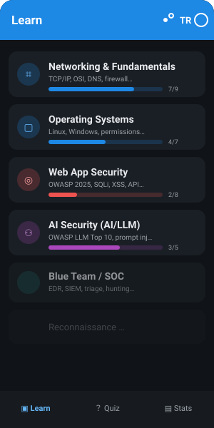
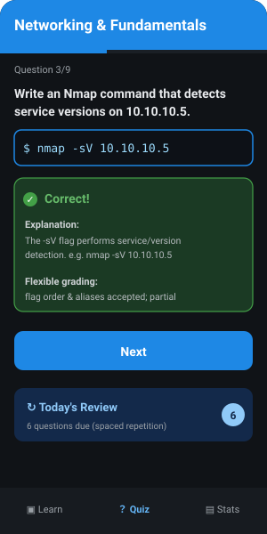
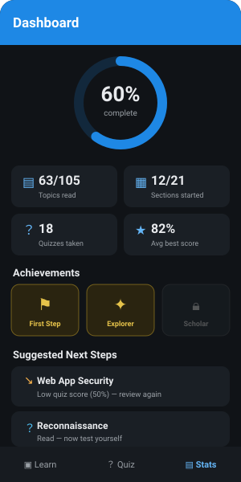

# CyberSec Academy

> A cross-platform (Flutter), interactive, **Turkish/English** cybersecurity learning app.
> Ethics- and defense-focused; all content is in the context of a legal lab / authorized testing.

[](LICENSE)


<p align="center">
  
  
  
</p>

> The images above are UI previews (mockups). To capture real screenshots, run the app and drop PNGs into `docs/screenshots/`.

---

## English

### Overview
CyberSec Academy teaches cybersecurity from beginner to advanced in an interactive, hands-on way. It runs from a single codebase on **Windows, Web, Linux, macOS, Android and iOS**, with instant **Turkish/English** switching and a light/dark theme.

All tools and techniques are taught **ethically**, only for use on your own systems, an isolated lab, or written-authorized testing. Every offensive topic is paired with a defense/detection counterpart and a "common mistake" note.

### Features
- **Learn:** 21 sections, 105 topics. Each cybersecurity section is a selectable option; under it, every topic opens as its own page with TR/EN markdown content — concept, code examples, a step-by-step mini-lab, defense notes and a "common mistake" callout.
- **Test:** a quiz per section (171 questions, 8–9 per section), with 6 question types — multiple choice, true/false, fill-in-the-blank, **command writing**, matching and ordering. Command questions are graded flexibly (flag-order independent, alias-aware, partial credit) and reveal the correct answer plus an explanation when wrong.
- **Spaced repetition:** missed questions are scheduled with a Leitner box system (1 → 3 → 7 → 16 → 35 days) and return in a "Today's Review" session.
- **Dashboard:** overall progress, stat cards, achievement badges and weak-area suggestions (tap to jump to the section).
- **Search:** instant search across sections/topics/tags (matches both TR and EN); tap a result to open the topic.
- **Settings:** language (TR/EN), theme (system/light/dark), reset progress, and an about/ethics section.
- **Persistence:** progress and the review schedule are saved to disk via `shared_preferences` and survive restarts.
- **Responsive & accessible:** content width is constrained on large screens, screen-reader labels, system font-scaling.

Content covers current topics: OWASP Top 10:2025, OWASP LLM Top 10:2025, cloud-native & Kubernetes, Zero Trust, post-quantum cryptography, OT/ICS, DevSecOps and SOC/Blue Team.

### Quick start
```bash
cd cybersec_app
flutter create . --platforms=windows,web   # generate platform files (lib/, pubspec, assets are preserved)
flutter pub get
flutter run -d windows                      # or: flutter run -d chrome
```
> For Windows desktop you need Visual Studio with the "Desktop development with C++" workload (check with `flutter doctor`).

### Project structure
```
.
├── README.md
├── LICENSE                 # MIT
├── CONTRIBUTING.md
├── .github/workflows/ci.yml
└── cybersec_app/           # Flutter app
    ├── lib/
    │   ├── features/learn/        # topic content (Learn)
    │   ├── features/quiz_engine/  # quiz + command-grading engine
    │   ├── features/review/       # spaced repetition (SRS)
    │   ├── features/progress/     # progress + dashboard
    │   ├── features/settings/     # language, theme, reset
    │   └── shared/                # markdown renderer
    ├── assets/learn/              # section content (JSON, TR/EN)
    ├── assets/quizzes/            # section quizzes (JSON, TR/EN)
    └── test/                      # unit + widget tests
```

### Testing
```bash
cd cybersec_app
flutter test       # unit + widget tests (including the command engine)
flutter analyze    # static analysis
```
CI runs `flutter analyze` + `flutter test` on every push/PR and builds a web artifact (`.github/workflows/ci.yml`).

### Ethics & legal notice
This app is a **learning tool**. All tools and techniques must be used only on your own systems, an isolated lab environment, or **written-authorized** penetration testing. Unauthorized access is a crime in most countries. Offensive topics are always presented with a defense/detection counterpart.

### License
[MIT](LICENSE) © 2026 berk

---

## Türkçe

### Genel Bakış
CyberSec Akademi, siber güvenliği yeni başlayandan ileri seviyeye kadar etkileşimli ve uygulamalı biçimde öğretir. Tek kod tabanından **Windows, Web, Linux, macOS, Android ve iOS** üzerinde çalışır; anlık **Türkçe/İngilizce** geçişi ve açık/koyu tema sunar.

Tüm araç ve teknikler **etik** çerçevede, yalnızca kendi sistemlerinde, izole lab ortamında veya yazılı izinli testte kullanılmak üzere öğretilir. Her saldırı konusu bir savunma/tespit karşılığı ve bir "yaygın hata" notuyla birlikte sunulur.

### Özellikler
- **Öğren:** 21 bölüm, 105 konu. Her siber güvenlik bölümü ayrı bir seçenek; altında her konu kendi sayfası olarak açılır ve TR/EN markdown içerik sunar — kavram, kod örnekleri, adım adım mini-lab, savunma notları ve "yaygın hata" kutusu.
- **Test:** her bölüm için bir quiz (171 soru, bölüm başına 8–9), 6 soru tipiyle — çoktan seçmeli, doğru/yanlış, boşluk doldurma, **komut yazma**, eşleştirme ve sıralama. Komut soruları esnek değerlendirilir (bayrak sırasından bağımsız, eşdeğer bayrak duyarlı, kısmi kredi) ve yanlışta doğru cevabı + açıklamayı gösterir.
- **Aralıklı tekrar:** yanlışlar Leitner kutu sistemiyle zamanlanır (1 → 3 → 7 → 16 → 35 gün) ve "Bugün Tekrar Et" oturumunda geri gelir.
- **Panel:** genel ilerleme, istatistik kartları, başarım rozetleri ve zayıf bölüm önerileri (dokununca o bölüme atlar).
- **Arama:** bölüm/konu/etiket üzerinde anlık arama (hem TR hem EN eşleşir); sonuca dokununca konu açılır.
- **Ayarlar:** dil (TR/EN), tema (sistem/açık/koyu), ilerlemeyi sıfırla ve hakkında/etik bölümü.
- **Kalıcılık:** ilerleme ve tekrar takvimi `shared_preferences` ile diske kaydedilir, uygulama kapansa da korunur.
- **Responsive & erişilebilir:** geniş ekranda içerik genişliği sınırlanır, ekran okuyucu etiketleri, sistem font ölçeğine uyum.

İçerik güncel başlıkları kapsar: OWASP Top 10:2025, OWASP LLM Top 10:2025, bulut-native & Kubernetes, Zero Trust, post-quantum kriptografi, OT/ICS, DevSecOps ve SOC/Mavi Takım.

### Hızlı başlangıç
```bash
cd cybersec_app
flutter create . --platforms=windows,web   # platform dosyalarını üret (lib/, pubspec, assets korunur)
flutter pub get
flutter run -d windows                      # veya: flutter run -d chrome
```
> Windows masaüstü için Visual Studio + "Desktop development with C++" iş yükü gerekir (`flutter doctor` ile kontrol et).

### Proje yapısı
```
.
├── README.md
├── LICENSE                 # MIT
├── CONTRIBUTING.md
├── .github/workflows/ci.yml
└── cybersec_app/           # Flutter uygulaması
    ├── lib/
    │   ├── features/learn/        # konu içeriği (Öğren)
    │   ├── features/quiz_engine/  # quiz + komut değerlendirme motoru
    │   ├── features/review/       # aralıklı tekrar (SRS)
    │   ├── features/progress/     # ilerleme + panel
    │   ├── features/settings/     # dil, tema, sıfırlama
    │   └── shared/                # markdown renderer
    ├── assets/learn/              # bölüm içerikleri (JSON, TR/EN)
    ├── assets/quizzes/            # bölüm quizleri (JSON, TR/EN)
    └── test/                      # birim + widget testleri
```

### Test
```bash
cd cybersec_app
flutter test       # birim + widget testleri (komut motoru dahil)
flutter analyze    # statik analiz
```
CI her push/PR'de `flutter analyze` + `flutter test` çalıştırır ve web build artefaktı üretir (`.github/workflows/ci.yml`).

### Etik & yasal uyarı
Bu uygulama bir **öğrenme aracıdır**. Tüm araç ve teknikler yalnızca kendi sistemlerinde, izole lab ortamında veya **yazılı izinli** sızma testinde kullanılmalıdır. Yetkisiz erişim çoğu ülkede suçtur. Saldırı konuları daima bir savunma/tespit karşılığıyla sunulur.

### Lisans
[MIT](LICENSE) © 2026 berk
